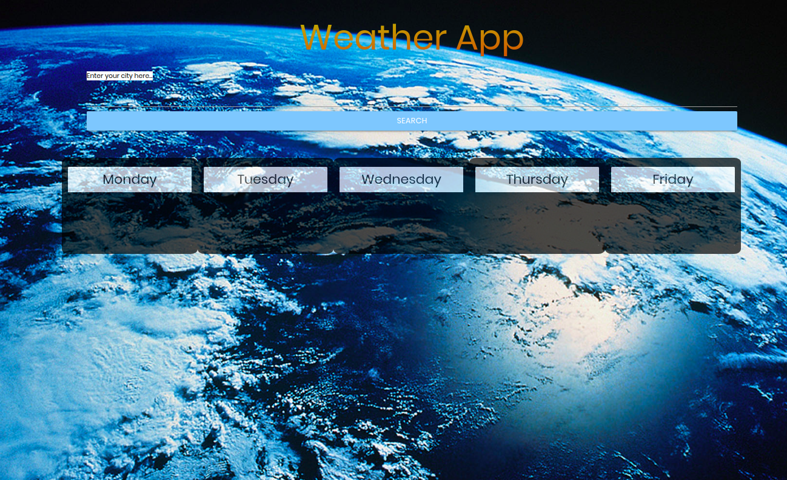
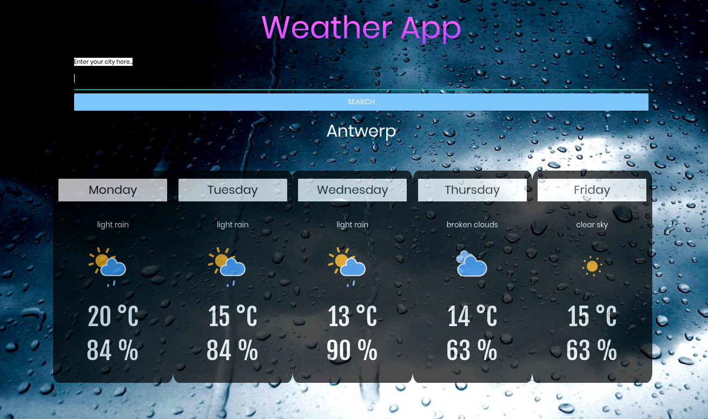

# Weather App

This is a weather app I made using HTML, CSS and Javascript. You will be able to search for any city in the world and it'll display all the information you need to decide if you have to use an umbrella or not.

[Feel free to check the weather!](https://weather-app-revamped.netlify.com/)

## Mission

- Learn how to use API.
- Learn async, await and promise.
- Create a weather app from an API.
- Use useful data from the API to display it using DOM manipulation.

## How does the app work

1. You can search a city by name by either pressing enter or pressing the search button.
1. City entered will be displayed.
1. Weather information including forecast, temperature and humidity will be displayed in a 5 day format.
1. Weather Icons change depending on the weather expectations.
1. Background images also change based on the weather.

## What did I learn from this

1. Improved my Javascript and write cleaner code.
1. Working with an API.
1. Fetch API  from https://openweathermap.org/api .
1. Concept of async and await.

## What was the most challenging

Figuring out how to get the data of the day since the API is configured to have data every 3 hours.

